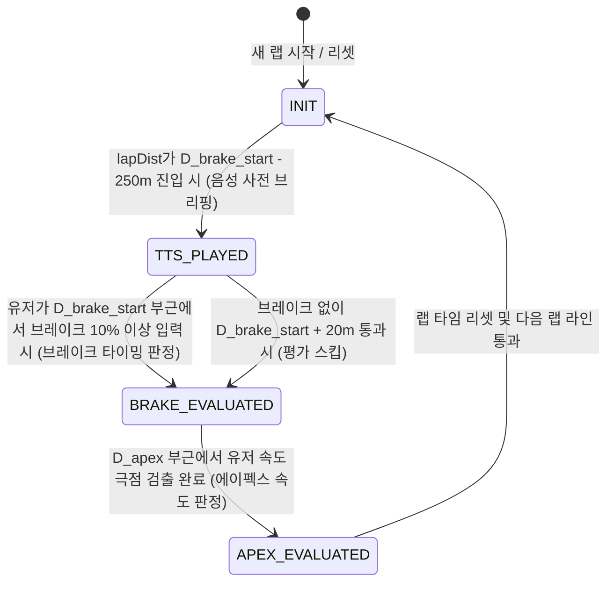

# Must Be The Apex - 구현 세부 명세서

본 문서는 **Must Be The Apex** 프로젝트의 실제 코딩 및 아키텍처 설계를 위한 세부 구현 명세서입니다. 1인 개발 최적화 및 100% 로컬 구동(Serverless)을 달성하기 위한 구체적인 모듈 설계와 데이터 스키마를 정의합니다.

---

## 1. 디렉토리 구조 (Directory Structure)

일렉트론(Electron) 메인 프로세스와 렌더러 프로세스를 완전히 분리하고, 데이터 연산 코어를 독립된 모듈로 관리합니다.

```text
must-be-the-apex/
├── .github/
│   └── workflows/
│       └── build.yml          # GitHub Actions 윈도우 자동 빌드 스크립트
├── src/
│   ├── main/                  # Main Process (Node.js)
│   │   ├── index.js           # 앱 엔트리 포인트 및 윈도우 생명주기 제어
│   │   ├── iracing-client.js  # node-irsdk 바인딩 및 데이터 스트리밍 관리
│   │   ├── db-manager.js      # SQLite DB 제어 및 로컬 적재 데이터 조회
│   │   └── analyzer.js        # 실시간 디스턴스 매칭, 코너 추출 및 상태 머신 코어
│   ├── renderer/              # Renderer Process (UI Overlay)
│   │   ├── index.html         # 투명 오버레이 메인 레이아웃
│   │   ├── style.css          # 프로그레스 바, 텍스트 및 플래시 애니메이션 스타일
│   │   └── ui-controller.js   # IPC 인터셉트 및 실시간 DOM 렌더링, Web Speech TTS 제어
│   └── preload.js             # IPC 통신용 브릿지 (Context Isolation 보안 적용)
├── assets/
│   └── mock/                  # 맥(macOS) 개발용 더미 텔레메트리 데이터 (.json)
├── package.json
└── electron-builder.json      # 빌드 및 패키징 설정 파일
```

---

## 2. 데이터 인프라스트럭처 설계

### 2.1 SQLite 로컬 레퍼런스 DB 스키마 (`db-manager.js`)
* **목적**: 개발자 또는 유저가 사전에 일괄 크롤링하여 **미리 적재해 둔(Pre-populated)** 트랙/차량별 레퍼런스 텔레메트리 데이터를 로드합니다. **앱 실행(런타임) 중 외부 API 다운로드 또는 크롤링 요청은 전혀 발생하지 않습니다.**
* **테이블명**: `reference_telemetry`

| 컬럼명 | 데이터 타입 | 제약 조건 | 설명 |
| --- | --- | --- | --- |
| `track_name` | TEXT | PRIMARY KEY (1) | iRacing 트랙 고유 코드 및 서브 레이아웃 명 |
| `car_name` | TEXT | PRIMARY KEY (2) | iRacing 차량 고유 이름 |
| `raw_csv_data` | TEXT | NOT NULL | 사전에 일괄 수집/적재된 Garage 61 Fixed 최고 랭커 원시 CSV 텍스트 |
| `created_at` | DATETIME | NOT NULL | 데이터 적재 관리용 타임스탬프 |

### 2.2 1m 리샘플링 및 인메모리 배열 캐시 (`telemetryCache`)
* 60Hz 실시간 텔레메트리 이벤트 리스너 내부에서의 SQLite 조회 오버헤드를 막기 위해, 세션 시작 시 CSV 데이터를 파싱하여 인메모리 JS 배열 형태로 캐싱합니다.
* **배열 명**: `telemetryCache` (크기: $D_{track\_length}$ 미터 정수형 크기)
* **배열 인덱스**: `lapDist`를 반올림한 정수값 ($0$ ~ $D_{track\_length}$)
* **요소(Element) 구조**:
  ```javascript
  telemetryCache[d] = {
    speed: number,     // 고수의 해당 지점 속도 (km/h)
    throttle: number,  // 고수의 쓰로틀 개도량 (0.00 ~ 1.00)
    brake: number,     // 고수의 브레이크 압력 (0.00 ~ 1.00)
    gear: number,      // 고수의 기어 단수 (0 ~ 6)
    steering: number   // 고수의 휠 조향각 (라디안 또는 도 단위)
  };
  ```
* **선형 보간(Linear Interpolation) 규칙**: 
  원시 G61 텔레메트리 데이터가 특정 미터 단위(예: 124.3m, 126.1m)로 불규칙하게 기록된 경우, 인접한 두 점을 기준으로 $d$ 미터 시점의 속도, 브레이크, 쓰로틀 값을 아래 선형 보간 공식을 통해 계산하여 $1\text{m}$ 정수 인덱스에 채웁니다.
  $$Y = Y_1 + (X - X_1) \times \frac{Y_2 - Y_1}{X_2 - X_1}$$

---

## 3. 핵심 알고리즘 및 엔진 설계

### 3.1 코너 자동 추출 알고리즘 (Dynamic Corner Extraction)
세션 로드 시 `telemetryCache`를 분석하여 코너 위치 및 공략 데이터를 파싱합니다. 외부 메타데이터 데이터베이스나 사용자 설정이 필요 없는 핵심 코어입니다.

1. **에이펙스(Apex) 후보지 포착 (Local Minima)**
   * `telemetryCache` 배열 전체를 탐색하며 속도가 감소하다가 다시 증가하는 극점을 찾습니다.
   * 노이즈 방지를 위해 윈도우 크기 $k = 15\text{m}$를 적용하여 $V_{ref}[d-k] > V_{ref}[d] < V_{ref}[d+k]$ 조건을 충족하는 $d$를 탐색합니다.
2. **코너 필터링 (False Positive Filtering)**
   * 포착된 Apex 후보 지점 $D_{apex}$ 전후 $20\text{m}$ 구간 내에서 **조향각 절대값의 평균이 임계치(예: $0.1\text{ rad}$) 이상**이고, **레퍼런스 브레이크의 최대 입력이 $10\%$ 이상**인 지점만 실제 코너로 판정합니다. 직선 도로에서의 미세한 감속이나 스핀 흔적을 제외하기 위함입니다.
3. **브레이크 개시 지점 ($D_{brake\_start}$) 파싱**
   * 확정된 Apex 지점 $D_{apex}$로부터 역방향(역방향 스캔 최대 $300\text{m}$)으로 탐색하여 레퍼런스 브레이크 값 $B_{ref}[d]$가 최초로 $0.05$ (5%)를 초과하기 시작한 지점을 $D_{brake\_start}$로 지정합니다.
4. **코너 구간 정의 및 데이터 구조화**
   * 코너 진입 구역: $[D_{brake\_start} - 30\text{m}, D_{brake\_start} + 20\text{m}]$
   * 음성 브리핑 구역: $[D_{brake\_start} - 250\text{m}, D_{brake\_start} - 240\text{m}]$
   * 최종적으로 추출되어 메모리에 적재되는 코너 객체 형식:
     ```javascript
     const detectedCorners = [
       {
         id: 1,                          // 코너 번호
         brakeStartDist: number,         // D_brake_start
         apexDist: number,               // D_apex
         targetGear: number,             // Apex 시점의 고수 기어 단수
         targetBrakeMax: number,         // 해당 코너 구간 내 고수의 최대 브레이크 압력 (0.0~1.0)
         state: 'INIT'                   // 상태 제어용: 'INIT' | 'TTS_PLAYED' | 'BRAKE_EVALUATED' | 'APEX_EVALUATED'
       },
       ...
     ];
     ```

### 3.2 코너 진행 상태 머신 (In-Game Coaching State Machine)
유저의 실시간 디스턴스 `lapDist` 변화에 따라 각 코너 오브젝트의 상태(`state`)를 제어하며 오버레이와 음성을 동기화합니다.



1. **TTS 브리핑 트리거**
   * 조건: `detectedCorners[i].state === 'INIT'` 이며 `lapDist`가 $[D_{brake\_start} - 250, D_{brake\_start} - 240]$ 범위에 있을 때.
   * 동작: `targetGear` 및 `targetBrakeMax` 정보를 담은 IPC 메시지 `tts-trigger` 전송 후 `state = 'TTS_PLAYED'` 변경.
2. **실시간 브레이킹 시점 판정**
   * 조건: `detectedCorners[i].state === 'TTS_PLAYED'` 이며 `lapDist`가 브레이크 판정 구간 $[D_{brake\_start} - 30, D_{brake\_start} + 20]$ 내에 있을 때.
   * 판정: 유저의 `Brake` 압력이 최초로 $0.10$ (10%)을 넘는 순간의 `lapDist`와 $D_{brake\_start}$ 간의 차이($\Delta D = \text{lapDist} - D_{brake\_start}$)를 계산.
     * $\Delta D < -15\text{m}$: `Early` (빠른 제동)
     * $\Delta D > 10\text{m}$: `Late` (늦은 제동)
     * 그 외: `Perfect`
   * 동작: IPC `brake-timing-fb`를 통해 결과값과 델타 거리 송신 후 `state = 'BRAKE_EVALUATED'`.
   * 만약 제동 없이 $+20\text{m}$ 선을 초과하면 피드백 없이 `state = 'BRAKE_EVALUATED'` 처리하여 지연 판정을 방지합니다.
3. **에이펙스 속도 판정**
   * 조건: `detectedCorners[i].state === 'BRAKE_EVALUATED'` 이며 `lapDist`가 $[D_{apex} - 15, D_{apex} + 15]$ 범위 내에 있을 때.
   * 판정: 이 구간 내에서 유저 속도(`Speed`)의 최저점(감속 후 재가속 시점)을 실시간으로 감지. 해당 최저점 속도와 고수의 에이펙스 속도($V_{ref}[D_{apex}]$)의 차이($\Delta V = V_{user\_min} - V_{ref\_apex}$)를 계산.
     * $\Delta V > 5\text{ km/h}$: `Overspeed` (진입 속도 초과)
     * $\Delta V < -5\text{ km/h}$: `Too Slow` (속도 부족)
     * 그 외: `Perfect`
   * 동작: IPC `apex-speed-fb`를 통해 결과값과 델타 속도 송신 후 `state = 'APEX_EVALUATED'`.

---

## 4. UI 오버레이 및 사운드 세부 명세 (Renderer)

### 4.1 일렉트론 윈도우 하드웨어 가속 설정
투명 오버레이 윈도우가 게임의 프레임레이트(FPS)에 영향을 미치거나 깜빡이는 현상을 방지하기 위해 `Main Process` 엔트리에서 아래 옵션을 인스턴스화합니다.

```javascript
// index.js
const { app, BrowserWindow } = require('electron');

// 크롬 오디오 정책 우회 및 마우스 관통 성능 보장
app.commandLine.appendSwitch('autoplay-policy', 'no-user-gesture-required');
app.commandLine.appendSwitch('enable-gpu-rasterization');

function createOverlayWindow() {
  const overlayWindow = new BrowserWindow({
    width: 1920,
    height: 1080,
    transparent: true,
    frame: false,
    alwaysOnTop: true,
    resizable: false,
    focusable: false, // 게임 윈도우 포커스 빼앗기 방지
    webPreferences: {
      preload: path.join(__dirname, '..', 'preload.js'),
      contextIsolation: true,
      nodeIntegration: false
    }
  });

  // Windows OS 레벨에서 투명창 마우스 관통 완벽 보장 (Click-through)
  overlayWindow.setIgnoreMouseEvents(true, { forwardToPanel: true });
  overlayWindow.loadFile(path.join(__dirname, '..', 'renderer', 'index.html'));
}
```

### 4.2 Web Speech API 무지연 오디오 모듈 (`ui-controller.js`)
* **구현 이유**: 외부 엔진이나 Powershell을 자식 프로세스로 호출 시 발생하는 100ms~500ms의 초기 실행 레이턴시를 0ms로 차단합니다.
* **음성 큐 관리 및 인터럽트**: 주행 상태가 매우 급변하므로, 이전 음성이 말하고 있더라도 새로운 음성 트리거가 오면 즉각 기존 오디오를 취소하고 최신의 행동 명령을 수행합니다.

```javascript
// ui-controller.js
window.apexAPI.onTTSTrigger((event, ttsData) => {
  const { gear, brakePercent, cornerId } = ttsData;
  const ttsText = `코너 ${cornerId}, 기어 ${gear}단, 브레이크 ${brakePercent} 퍼센트 준비`;

  // 1. 기존 재생 중인 음성이 있다면 즉시 중단(인터럽트)하여 음성 밀림 방지
  if (window.speechSynthesis.speaking) {
    window.speechSynthesis.cancel();
  }

  const utterance = new SpeechSynthesisUtterance(ttsText);
  
  // 2. 엔진 튜닝 (빠른 재생 속도와 선명한 가이드 유도)
  utterance.rate = 1.25;  // 1.25배속으로 주행 상황에 신속 대응
  utterance.pitch = 1.0;  // 평온한 어조 유지
  
  // 3. 로컬 윈도우 OS의 한국어 기본 음성 우선 설정 (없으면 기본값)
  const voices = window.speechSynthesis.getVoices();
  const koVoice = voices.find(voice => voice.lang.includes('ko-KR'));
  if (koVoice) {
    utterance.voice = koVoice;
  }

  window.speechSynthesis.speak(utterance);
});
```

---

## 5. 예외 처리 및 방어 코드 (Edge Cases)

### 5.1 레퍼런스 데이터 부재 시 예외 처리 (Missing Telemetry)
* **상황**: 유저가 사전에 로컬 SQLite DB에 적재해 두지 않은 트랙/차량 조합으로 세션에 진입하는 경우.
* **해결책**:
  * `db-manager.js`에서 쿼리 조회 결과가 `null`인 경우, `analyzer.js`에 예외 이벤트를 전달합니다.
  * `analyzer.js`는 IPC를 통해 `reference-missing` 신호를 Renderer로 송신합니다.
  * 오버레이 화면 우상단 또는 중앙에 *"레퍼런스 데이터 없음 (DB 일괄 적재 필요)"* 알림을 표시하고 상태 머신 연산을 안전하게 우회 및 중단시켜 메모리 에러를 방지합니다.

### 5.2 iRacing과 G61 트랙 길이 불일치 정밀 보정 (Track Distance Calibration)
* **상황**: iRacing 내부에서 리포트하는 트랙 총길이(`track_length`)와 Garage 61 GPX/CSV 원시 데이터상 기록된 랩의 최대 거리 간에 미세한 오차(약 10m~30m 내외)가 존재할 수 있습니다. 보정이 없으면 랩 후반부 코너들의 피드백 타이밍이 어긋납니다.
* **해결책**: 레퍼런스 데이터 로딩 단계에서 스케일링 팩터 $S$를 구하여 코너 추출 거리 정보를 캘리브레이션합니다.
  $$S = \frac{\text{iRacing TrackLength}}{\text{G61 Max LapDist}}$$
  모든 코너의 `brakeStartDist`, `apexDist`, `exitDist`에 $S$를 곱하여 주행 중인 실시간 `lapDist`와의 절대적인 축척 거리를 완벽히 일치시킵니다.

### 5.3 드라이버 역주행, 스핀 및 코스 아웃 예외 처리
* **상황**: 유저가 사고로 차가 돌거나(Spin), 코스를 이탈하여 거꾸로 주행할 경우 `lapDist` 값이 역류하여 코너 상태 머신이 오동작하거나 다발적인 TTS 경고가 울리게 됩니다.
* **해결책**:
  * 매 프레임마다 이전 프레임의 `prevLapDist`와 현재 프레임의 `lapDist` 차이를 모니터링합니다.
  * 만약 1프레임 동안 역주행 상태($\Delta D < 0$)가 감지되거나, $100\text{m}$ 이상의 정방향 비정상 순간 이동(순간적인 크래시 혹은 리스폰)이 감지되면 상태 머신 연산을 일시정지(`PAUSE`) 상태로 전환합니다.
  * 유저가 차량 정렬 후 정상 방향 주행으로 최소 $50\text{m}$ 이상 부드럽게 전진하면 `PAUSE` 상태를 해제하고 코너 상태 동기화를 다시 활성화합니다.